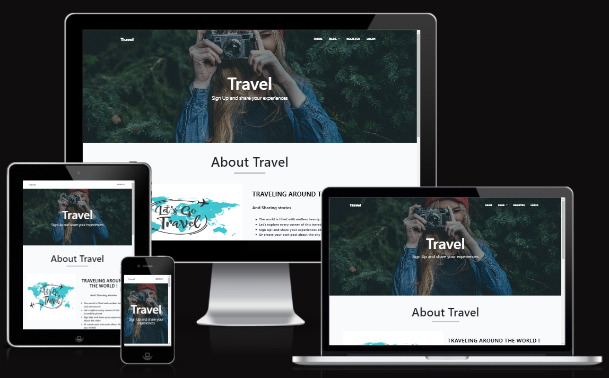
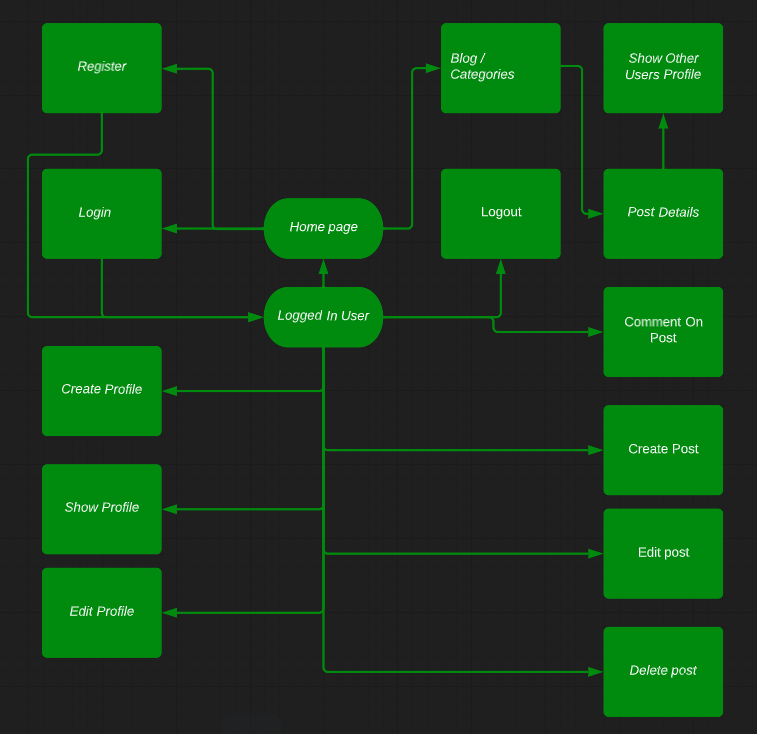

# Travel

This blog is for users who want to share their adventures and experiences from their travels. Users can read and share information about places to visit, what to eat at these places, and what adventures await them at these places. 

Unregistered users can read the posts from the different categories.

Registered users can create, edit and delete their own posts. They can also comment and like other people's posts.

for the live website click
[here](https://project---4.herokuapp.com/)

## 1. User Experience (UX)

### First Time Visitor Goals
- as a first time visitor, I would like to see a clear home page
- As a first time visitor, I would like to easily navigate through the website.
- As a first time visitor, I would like to see the posts and the different categories.
- as a First Time visitor, I would like to register.

### Returning Visitor Goals
- As a returning visitor, I would like to login.
- As a returning visitor, I would like to like posts. 
- As a returning visitor, I would like to comments on posts.
- As a returning visitor, I would like to create, read, edit and delete my own posts.
- As a returning visitor, I would like to logout when I want.

## agile
### Scope
For the scope of this project the following key points were determined.

- Create a webpage application using the Django framework.
- Use bootstrap to make the site responsive, and custom CSS and Java Script to complement.
- Allow the user to create an account in order to upload content.
- Allow logged in users to interact with other posts through comments and actions.
- Allow users to manipulate their content (CRUD Operations).
- The frontend should be simple and present the content in a clear way.
- The website should be functional, easy to navigate and intuitive.

To do - In Progress - Done click
[here](https://github.com/MustafaSahinci/project-portfolio-4/projects/1)

For the Milestones click
[here](https://github.com/MustafaSahinci/project-portfolio-4/milestones)

