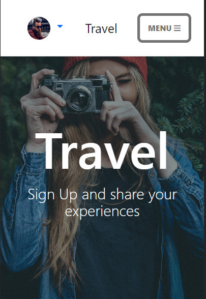
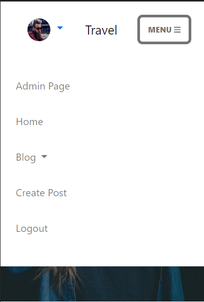

# Travel

This blog is for users who want to share their adventures and experiences from their travels. Users can read and share information about places to visit, what to eat at these places, and what adventures await them at these places. 

for the live website click
[here](https://project---4.herokuapp.com/)

## 1. User Experience (UX)

Unregistered users can read the posts from the different categories and look at the profile from other users.

Registered users can create, edit and delete their own posts. They can also comment and like other people's posts. The users can also create and edit their own profile.

### First Time Visitor Goals
- as a first time visitor, I would like to see a clear home page
- As a first time visitor, I would like to easily navigate through the website.
- As a first time visitor, I would like to see the posts and the different categories.
- as a first time visitor, I would like to see the profile of the users.
- as a First Time visitor, I would like to register.

### Returning Visitor Goals
- As a returning visitor, I would like to login.
- As a returning visitor, I would like to like posts. 
- As a returning visitor, I would like to comment on posts.
- As a returning visitor, I would like to create, read, edit and delete my own posts.
- As a returning visitor, I would like to create and edit my own profile
- As a returning visitor, I would like to see al my own post in my profile page
- As a returning visitor, I would like to logout when I want.

## agile
Agile is an approach to project management that centers around incremental and iterative steps to completing projects. The incremental parts of a project are carried out in short-term development cycles

I used the Canban board in github projects and issues which you can see 
[here](https://github.com/MustafaSahinci/project-portfolio-4/projects/1)

And I used the github Milestones for the sprints which you can see
[here](https://github.com/MustafaSahinci/project-portfolio-4/milestones)

### Scope
For the scope of this project the following key points were determined.

- Create a webpage application using the Django framework.
- Use bootstrap to make the site responsive.
- Allow the user to create an account so that they can create their own post and profile.
- Allow logged in users add comments so they can communicate with each other
- Allow users to Crud(Create, Read, Update and Delete) their posts and profile.
- The website should be easy to navigate and everything should be clear

### Site map

## 2. Features

Navigation And Footer

 

Unregistered User

Registered user

Admin

Responsive Navigation

Responsive Navigation dropdown

Categories Dropdown

Created Profile Dropdown

Not Created Profile dropdown

Footer

Home Page

 

Masthead/Hero-image same on every page except Post Details

About Section

Categories Section

Blog And Categories

 

Blog page where you can find all the posts

Adventure page where you can find the posts with the category adventure

Food page where you can find the posts with the category food

Location page where you can find the posts with the category location

Post CRUD

 

Create Post

Post Detail

Post Detail logged in user and own post

Post detail logged in user but not own post

Post Detail not logged in

Edit your post

Edit your post

Delete your post?

Profile CRUD

 

Profile create

Profile page with profile detals and all own posts

Profile Edit

Log In/Out and Register

 

Login Page

Logout Page

Register Page

### future features
- Users can login with their social media accounts
- delete the comment approval so users can chat easily with eachother
- Add more categories

