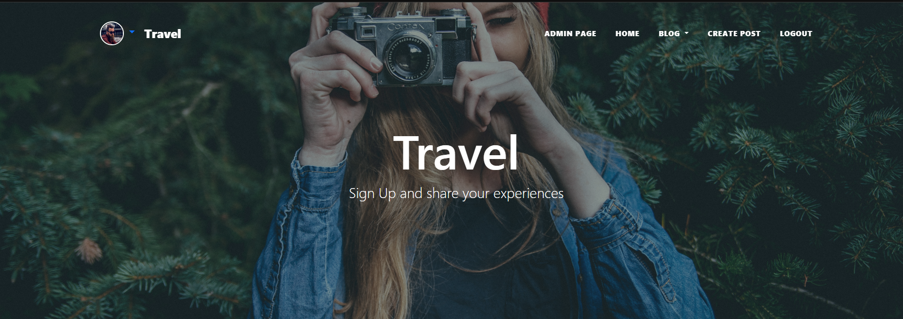
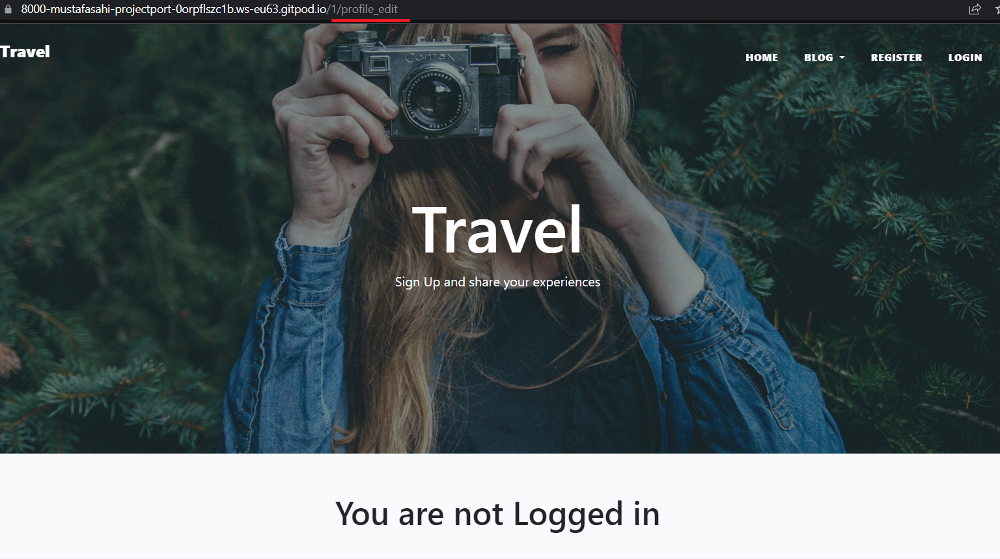
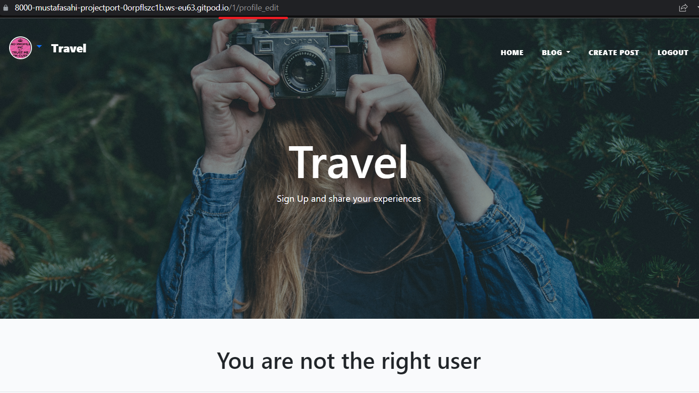

# Travel

This blog is for users who want to share their adventures and experiences from their travels. Users can read and share information about places to visit, what to eat at these places, and what adventures await them at these places. 

for the live website click
[here](https://project---4.herokuapp.com/)

## 1. User Experience (UX)

Unregistered users can read the posts from the different categories and look at the profile from other users.

Registered users can create, edit and delete their own posts. They can also comment and like other people's posts. The users can also create and edit their own profile.

### First Time Visitor Goals
- as a first time visitor, I would like to see a clear home page
- As a first time visitor, I would like to easily navigate through the website.
- As a first time visitor, I would like to see the posts and the different categories.
- as a first time visitor, I would like to see the profile of the users.
- as a First Time visitor, I would like to register.

### Returning Visitor Goals
- As a returning visitor, I would like to login.
- As a returning visitor, I would like to like posts. 
- As a returning visitor, I would like to comment on posts.
- As a returning visitor, I would like to create, read, edit and delete my own posts.
- As a returning visitor, I would like to create and edit my own profile
- As a returning visitor, I would like to see al my own post in my profile page
- As a returning visitor, I would like to logout when I want.

## agile
Agile is an approach to project management that centers around incremental and iterative steps to completing projects. The incremental parts of a project are carried out in short-term development cycles

I used the Canban board in github projects and issues which you can see 
[here](https://github.com/MustafaSahinci/project-portfolio-4/projects/1)

And I used the github Milestones for the sprints which you can see
[here](https://github.com/MustafaSahinci/project-portfolio-4/milestones)

### Scope
For the scope of this project the following key points were determined.

- Create a webpage application using the Django framework.
- Use bootstrap to make the site responsive.
- Allow the user to create an account so that they can create their own post and profile.
- Allow logged in users add comments so they can communicate with each other
- Allow users to Crud(Create, Read, Update and Delete) their posts and profile.
- The website should be easy to navigate and everything should be clear

### Site map

## 2. Features

Navigation And Footer

 

the navigation can be found at the top of the website. If you are not logged in, you will see register and log in, if you are logged in, you will see create post and logout, and if you are an admin you will also see an admin page link.

The blog link has a dropdown where you can choose categories if you wish. Logging in will also display your profile picture with a dropdown menu on the left side of the navigation where you can create, view, and edit your profile.

The navigation adapts to smaller screens by becoming a hamburger menu and the footer has social media links and is a simple design. the navigation and the footer are parts of the base.html

Unregistered User

Registered user

Admin

Responsive Navigation

Responsive Navigation dropdown

Categories Dropdown

Created Profile Dropdown

Not Created Profile dropdown

Footer

Home Page

 

The home page is kept simple. it consists of a hero image with the navigation on it. The hero image is part of the base.html

Following that is an about section with a brief description of the site and a link to the blog.

The last part of the page is a category section where you will find the categories that you can expect

Masthead/Hero-image same on every page except Post Details

About Section

Categories Section

Blog And Categories

 

All posts can be found on the blog page. This page displays the photo, title, excerpt, author, category, date time, and likes for the post.

Below the post you will find a category link that will take you to that category's page. On the category page, you will only see posts associated with that category. 

All of these pages have a pagination of no more than six posts

Blog page where you can find all the posts

Adventure page where you can find the posts with the category adventure

Food page where you can find the posts with the category food

Location page where you can find the posts with the category location

Post CRUD

 

Creating your own post is easy. You can enter a title, excerpt, and content, upload a photo, and choose a category.

On the post detail page, the hero image changes to the actual post image with the post details.

Below this is the title and content of the post, as well as how many likes and comments the post has. Here you'll also see who the author is, and if the author created a profile, you'll also see their profile picture, which you can press to go to their profile page.

You can see the comments below. If you are logged in, you can post your comments. And if you created this post yourself, you will also see a link to edit and delete the post.

You can change anything about your post on the post edit page. And on the delete page you can delete your post

Create Post

Post Detail

Post Detail logged in user and own post

Post detail logged in user but not own post

Post Detail not logged in

Edit your post

Edit your post

Delete your post?

Profile CRUD

 

If you haven't created a profile, you will see the link in the navigation. On the profile create page, you can enter your first name, last name, bio, social media links, and upload your photo.

On the profile detail page you see the username, photo, first name, last name, social media links and the bio of the author. And below are all the posts created by this author

You can change anything about your profile on the profile edit page.

Profile create

Profile page with profile details and all own posts

Profile Edit

Log In/Out and Register

 

these pages are for logging in/out and registering

Login Page

Logout Page

Register Page

### future features
- Users can login with their social media accounts
- delete the comment approval so users can chat easily with eachother
- Add more categories

## 3. Technologies used
- HTML5 used for markup
- CSS3 used for style
- JavaScript
- Python
- Bootstrap - Used for styling the site.
- PostgreSQL - Used as database for this project
- Ludichart - Used to create the site map.
- amiresponsive Used to see how responsive the site is on different devices.
-Cloudinary used to storing images and static files.
- Django Framework used to build the site and admin page.
- Font Awesome used for icons
- Git used for version control, using the terminal to commit - to Git and Push to GitHub
- GitHub is used to store the projects code after being pushed from Git.
- Gitpod to write my code.
- Google Chrome Dev tools used for debugging.
- Google Lighthouse used for audits to measure the quality of web pages.
- Heroku used to deploy this app.

## 4. Testing
Manual testing occurred regularly throughout local development and this project has been tested manually after deployment on Heroku

Test

 

All form validations are working here, and if you are not logged in or the wrong user, you cannot access the page

All the links, buttons and features are working

for login this error show up:
The username and/or password you specified are not correct.

and for register you can see these errors:
The password is too similar to the username.
This password is too short. It must contain at least 8 characters.
This password is too common.

 

### W3C Markup Validation Service
All html pages are tested and only few errors because of django tags

### W3C CSS Validation Service
CSS tested with no errors

### Pep8
All python code tested with no errors

### Lighthouse

## 5.Bugs
- On the profile create page, I only added code that allows users to see the page if they are authorized. However, this allowed other users who had already created a profile to access it as well. Then when they pressed create, an error appeared because this id has already an profile. Here, I added the code [% if user.profile.first_name %]. Users who already have a profile will not be able to access this page if this is true; instead, they will see you are not the right user.

### Remaining Bugs
- No known errors remaining.

## 6. Deployment
This project was created on GitHub and Edited in GitPod by carrying out the following:

- A new repository was created using 'Code-Instutute-Org/gitpod-full-template'
- A meaningful name was given to the new repository and 'Create Repository' was selected
- The repository was then opened on GitHub by clicking - - the 'Gitpod' button to build the GitPod workspace which would allow me to build and edit the code used to make the PROJECT NAME HERE website/application
- Version control was used throughout the project using the following commands in the terminal using Bash
git add . OR git add "file name" - to stage the changes and get them ready for being committed to the local repo.
git commit -m "Description of the update" - to save the change and commit the change to the local repo
git push - to push all committed changes to the GitHub repo associated with the GitPod workspace
- Project Deployment
This project was deployed via Heroku by carrying out the following:

- Create the gitpod repo from the template via the gitpod button in github.
- Log in to Heroku and create a new app.
- Add the heroku-postgres add-on
- Complete the config vars section
- Link Heroku and GitHub accounts together
- Select the repo (via Heroku) that you want to make an app of and give it a name in Heroku.
Click on deploy.

## 7. Credits
- My mentor Rohit Sharma
- Code institute slack community
- Stackoverflow
- django documentation
- bootstrap documentation
- The youtube tutorial from John Elder https://www.youtube.com/playlist?list=PLCC34OHNcOtr025c1kHSPrnP18YPB-NFi

### media
- images from google

